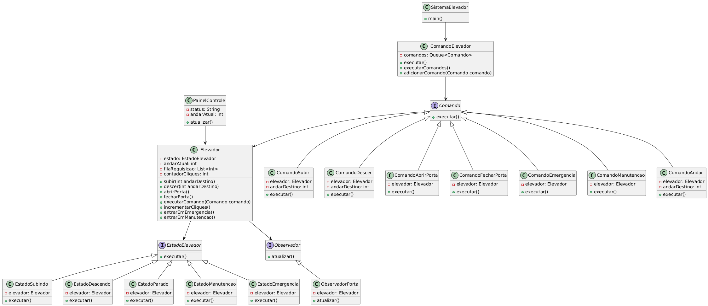
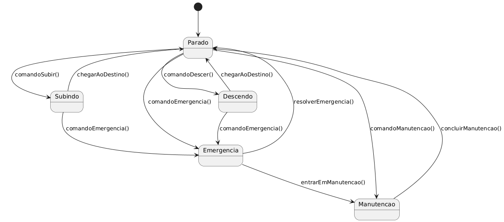

# Sistema de Controle de Elevador
##### Padrões de Projeto de Software - Colaborativa 03

Este projeto implementa um sistema de controle de elevador utilizando conceitos de Orientação a Objetos e três padrões de projeto principais: Command, Observer e State. O objetivo é criar um sistema modular, flexível e de fácil manutenção, simulando o funcionamento de um elevador que atende a diferentes andares e possui interações com o usuário.

# Como funciona o sistema

O sistema permite ao usuário escolher se deseja subir ou descer, selecionar um andar entre 0 e 10, e controlar o movimento do elevador, mostrando mensagens de abertura e fechamento de portas nos momentos corretos. Há também a implementação de uma lógica de emergência e manutenção em caso de uso excessivo.

# Estrutura do Código

### Elevador 
A classe principal que controla o movimento do elevador.

### PainelControle
Exibe as atualizações do estado do elevador.

### SistemaElevador
O sistema principal que gerencia a interação com o usuário e a lógica de manutenção e emergência.

# Padrões de Projeto Utilizados

## 1. Command
O padrão Command é utilizado para encapsular as ações que o elevador pode realizar, como subir e descer. Cada ação é representada por um comando, permitindo que as operações possam ser executadas ou desfeitas de forma flexível. Isso facilita o controle de múltiplas ações do elevador em diferentes situações, como reagir a comandos de subida, descida, ou até mesmo à ativação de um

### Implementação no projeto:
O sistema encapsula as operações de subir e descer em métodos que podem ser facilmente modificados ou estendidos, sem impactar a lógica principal do elevador.

## 2. Observer
O padrão Observer é utilizado para que o painel de controle observe as mudanças no estado do elevador e exiba as atualizações automaticamente ao usuário. O elevador notifica o painel sempre que seu estado é alterado (como quando muda de andar), e o painel então exibe as informações correspondentes ao usuário.

### Implementação no projeto:
Elevador atua como o sujeito observado, enquanto o PainelControle é o observador. Sempre que o elevador muda de estado, o painel é atualizado.

## 3. State
O padrão State é utilizado para gerenciar os diferentes estados do elevador, como normal, em emergência, ou em manutenção. Dependendo do estado atual, o comportamento do elevador muda. Por exemplo, quando o elevador está em manutenção, ele não processa novos comandos e aguarda o tempo de 10 segundos antes de voltar ao estado normal.

### Implementação no projeto:
O elevador tem diferentes estados que determinam seu comportamento: quando em emergência, ele entra automaticamente em manutenção por um período de 10 segundos antes de voltar ao normal.

# Diagrama de Classe
## 01. principal

## 02. State

# Como Executar

1. Clone este repositório do GitHub usando o comando "git clone https://github.com/mukslima/Elevador" ou Baixe o repositório em formato ZIP clicando no botão 'Code' e, em seguida, em 'Download ZIP' 
2. Compile e execute o projeto Java.
3. Utilize o terminal para interagir com o sistema, selecionando subir ou descer e escolhendo os andares desejados.

# Fluxo de interação com o Usuário

1. O sistema solicita que o usuário escolha se deseja subir ou descer.
2. O usuário seleciona o andar desejado dentro dos limites permitidos (0 a 10).
3. O elevador inicia o movimento, exibindo a mensagem "Porta fechada".
4. O elevador percorre os andares, atualizando o painel de controle.
5. Ao chegar ao andar selecionado, exibe a mensagem "Porta aberta".
6. O processo pode se repetir, e em caso de uso excessivo (mais de 5 movimentos consecutivos), o elevador entra em estado de emergência e depois em manutenção por 10 segundos.

# Regras de Operação

1. Não é possível subir acima do 10º andar.
2. Não é possível descer abaixo do térreo (0º andar).
3. Em caso de uso excessivo, o elevador entra em modo de emergência e, após 10 segundos, retorna ao estado normal.

# Melhorias Futuras 

- Implementar um sistema de prioridade nas chamadas para otimizar o fluxo de passageiros.
- Adicionar suporte a múltiplos elevadores com controle de alocação.
- Melhorar o design da interface do usuário com uma GUI.

# Contribuições

Contribuições são bem-vindas! Sinta-se à vontade para fazer um fork deste projeto e enviar pull requests com melhorias e correções de bugs.

